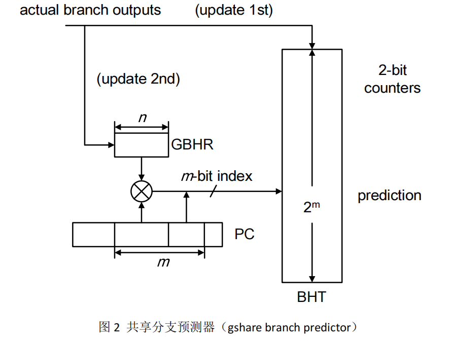

# 《高等计算机体系结构》实验报告
- 学院：智能与计算学部
- 年级： 2019级
- 班级： 4 班
- 课程名称：高等计算机体系结构
- 实验项目名称：分支预测

## 实验目的
- 设计一个基于 PC 的简单分支预测器(bimodal branch predictor)
- 设计基于 PC 和全局分支寄存器(global branch history register, GBHR) 的共享分支预测器
- 利用所设计的分支预测器对 SPEC benchmark 地址流进行仿真，分许分支预测性能  
  
## 实验内容
- 分别设计完成可模拟简单分支预测器和共享分支预测器的仿真器。
- 该仿真器使用具有标准格式的 PC 地址流文件作为输入(该地址流已由 SPEC 标准测试程序产生)，并将最终分支历史表(branch history table, BHT)中所存储内容，即 2-bit 饱和计数器的计数值和分支预测结果以标准格式输出到结果文件中。

## 实验原理和步骤
### 简单分支预测器(bimodal branch predicotr)
简单分支预测器的结构如图 1 所示，该预测器结构仅仅以分支指令的 PC 地 址作为访问分支历史表 BHT 的索引。其中，该索引并不是采用分支指令的全部 PC 地址，而是仅使用 PC 地址的低 m 位作为索引。注意，因为对于 32-bit 字节 编址处理器，PC 地址均是 4 字节对齐，因此 PC 地址的最末两位一定是“00”， 故最终采用 PC 地址中的“2 ~ m+1”位作为访问 BHT 的索引。  

**BHT 中的每一项：**  

BHT 中的每一项都是一个 2-bit 饱和计数器。BHT 中的所有计数器在仿真开始时，应当被初始化为“2”，即“弱跳转”（“weakly taken”）。  

**关于分支冲突：**

由于仅仅使用一部分 PC 地址去索引 BHT，因此不同的分支可能会访问 BHT 中相同的项，称为“冲突”。在分支预测器中发生冲突不会产生问题，因为预测误还会被纠正，所以并不会被检测或避免冲突（It just happen！）。  

  
  
**操作流程：**
当从 trace 文件中获得分支的 PC 地址后，需要完成以下 3 步完成预测：  

(1). 根据“m”取值从 PC 地址中获得访问 BHT 的索引。  

(2). 对分支方向进行判定。利用索引访问 BHT 中对应的 2-bit 计数器。如果计数器的计数值不小于 2，则预测分支发生跳转；否则预测分支不发生跳转，程序顺序执行。  

(3). 基于分支的实际输出更新分支预测器。当分支发生跳转时，BHT 中所对应的计数器递增“1”；若不发生跳转，BHT 中所对应的计数器则减“1”。注意，计数器将在“0”和“3”时进入饱和状态，即当计数值为“3”时，计数值不能再增加，而当计数值为“0”时，计数值不能再减少。  

### 共享分支预测器(gshare)  

相比 bimodal 分支预测器，共享分支预测器设置了一个 n 位全局分支历史寄存器（global branch history register，GBHR）。访问 BHT 的索引由分支指令的PC 地址和 GBHR 共同决定，其结构如图 2 所示。全局分支历史寄存其在仿真开始时被初始化为全 0（00…0）。  
  
  
  
**操作流程：**
当从 trace 文件中获得分支的 PC 地址后，需要完成以下 4 步完成预测：  

(1). 根据分支的 PC 地址和 GBHR 中的内容共同决定访问 BHT 的索引。将分支 PC 地址中作为索引的 m 位中的高 n 位与 n 位 GBHR 中的内容进行 XOR 异或运算，将最终生成的 m 位索引送入 BHT 中查找对应的 2-bit 饱和计数器。  

(2). 对分支方向进行判定。利用索引访问 BHT 中对应的 2-bit 计数器。如果计数器的计数值不小于 2，则预测分支发生跳转；否则预测分支不发生跳转，程序顺序执行。  

(3). 基于分支的实际输出更新分支预测器。当分支发生跳转时，BHT 中所对应的计数器递增“1”；若不发生跳转，BHT 中所对应的计数器则减“1”。注意，计数器将在“0”和“3”时进入饱和状态，即当计数值为“3”时，计数值不能再增加，而当计数值为“0”时，计数值不能再减少。  

(4). 基于分支的实际输出更新全局分支历史寄存器 GBHR。首先，将 GBHR 中的内容右移 1 位，然后将分支的实际输出存放在 GBHR 的最高有效位。  
  
## 结果验证

## 项目说明
本项目使用 Rust 语言构建，提供了 `Makefile` 和 `build.sh` 来帮助运行，可以通过修改 `Makefile` 中的参数或者使用 `build.sh` 运行所有测试用例